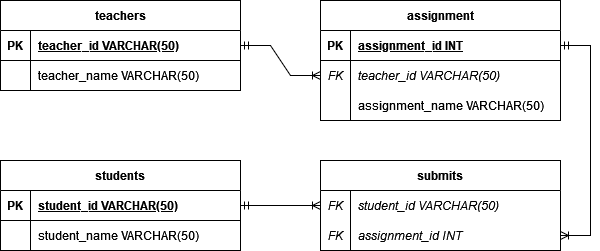

# 学生作业管理系统

## 简介

本项目是数据库大作业（数据库课程设计）。本项目较为综合，包含了数据导入导出（csv和json）、数据库的连接、编写测试所需的测试用例，是本人目前（截止至2024年六一儿童节）最为复杂的项目之一（另一个是CS50x的tideman）。

程序主入口为分为两部分，backend目录下的`app.py`和frontend目录下运行`npm run dev`。`tests`目录下包含了一些自动化测试，包含一些简单的测试用例。可以在改错代码的时候适当提醒。测试可以确保你的代码按照你的想法运作，我建议各位一遍写代码一遍写测试，不然后期会很痛苦。不会写测试的可以查看下面的参考文献。

有问题可以提issue，有优化可以提PR。

绘图使用draw.io，代码编辑器是vscode。

## 许可证

许可证为GPLv2 or later。所有说明文档与图表等如果没有特别说明均为CC4.0-BY-SA授权（如果是交作业的可以豁免署名，但仍然要遵守知识共享）。如果需要其他授权的请联系我（这么简单的东西真的会有人需要商业授权吗？）。

## 技术栈

Python, Flask, SQLite。

将数据存放在SQLite中，通过Python进行调用。

## E-R图

  
注意：该图片包含了源数据，使用draw.io打开`README.assets/er.png`即可编辑。

## 数据表类图

  
注意：该图片包含了源数据，使用draw.io打开`README.assets/class.png`即可编辑。

学生表记录学生的姓名和学号
```sql
-- 学生表
CREATE TABLE "students" (
	"student_id" VARCHAR(50) NOT NULL,
	"student_name" VARCHAR(50) NOT NULL,
	PRIMARY KEY ("student_id")
)
;
```
登记表记录学生作业提交状态
```sql
-- 作业统计表
CREATE TABLE "submits" (
    "student_id" VARCHAR(50) NOT NULL,
    "status" INTEGER NOT NULL DEFAULT 0,
    CONSTRAINT "fk_student_id" FOREIGN KEY ("student_id") REFERENCES "students" ("student_id") ON UPDATE CASCADE ON DELETE NO ACTION
);

```


## 使用说明

### 构建开发环境
安装Python虚拟环境,自行调整requirements的路径。
```bash
py -3 -m venv venv
venv\Scripts\activate
pip install -r requirements.txt
```

## 开发说明

### 流程

向程序提供已提交作业所在的位置，程序会历遍文件夹，读取所有文件名。`load_filenames`

程序会从数据库中查询学号`read_sid`和本次实验标题，生成一份标准名单。  `create_std_list`
比较读取的文件名在不在标准名单中check_filenames，若在则视为已提交`1`，不在提交名单中的视为缺交`0`，不在标准名单中的视为错误文件名`error`。  
尝试从错误的文件名中读取学号，如果成功，记为提交并重命名，rename_filenames不成功则记入其他列表`etc`。最后不应该存在error。

将已提交作业的名单写入数据库。如果存在则忽略。

与数据库中全体学生相比较，顺便修正文件名错误的文件，并写入数据库。

```json-with-comment
{
	sid: 202415210201,
	hw: "202415210201-张三-实验报告"
	status: 0,
	path: null
}
```

#### 获取文件名

切换到作业所在位置。`check_tools.py`提供函数支持。`t.get_all_file(abs_path)`接受一个绝对路径并查找路径中所有的文件名，返回一个列表。

#### 查找已提交作业

数据库联查s_id和a_title`d.load_data()`。 生成文件名名单`t.generate_filenames()`，比较文件`t.check_files()`。查找学生ID`t.read_id()`，修正文件名`t.rename_file()`。判断提交与缺交。

传入路径后，给出列表，根据id和破损文件名元组，生成争取文件名元组，将fix_list[i]替换src[i][0]

#### 写入数据库

将已提交的写入submits`d.save_data()`，未提交的记入字典保存。


## 参考文献

[Python文档库：os](https://docs.python.org/zh-cn/3/library/os.html)  

[Python文档库：re](https://docs.python.org/zh-cn/3/library/re.html)  

[Python文档库：csv](https://docs.python.org/zh-cn/3/library/csv.html)  

[Python文档库：json](https://docs.python.org/zh-cn/3/library/json.html)  

[Python文档库：open](https://docs.python.org/zh-cn/3/library/functions.html#open)

[Python文档库：sqlite3](https://docs.python.org/zh-cn/3.9/library/sqlite3.html)  

[Python文档库：os.path](https://docs.python.org/zh-cn/3/library/os.path.html)  

[Python文档库：unittest](https://docs.python.org/zh-cn/3/library/unittest.html)  

[哔哩哔哩：unittest新手入门](https://www.bilibili.com/video/BV1sZ4y1i7nQ/)  

[正则表达式测试网站：regex101](https://regex101.com/) 

[绘图工具：draw.io](https://app.diagrams.net/)

[ant design vue组件总览](https://antdv.com/components/overview-cn)