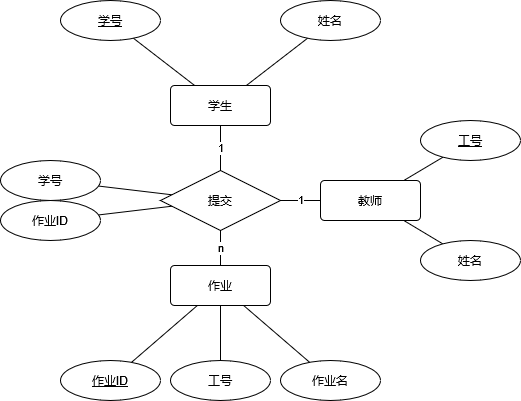

# 学生作业管理系统

## 简介

本项目是数据库大作业（数据库课程设计）。本项目较为综合，包含了数据导入导出（csv和json）、数据库的连接、编写测试所需的测试用例，是本人目前（截止至2024年六一儿童节）最为复杂的项目之一（另一个是CS50x的tideman）。

程序主入口为`app.py`。

有问题可以提issue，有优化可以提PR。

## 许可证

许可证为GPLv2 or later。所有说明文档与图表等如果没有特别说明均为CC4.0-BY-SA授权（如果是交作业的可以豁免署名，但仍然要遵守知识共享）。如果需要其他授权的请联系我（这么简单的东西真的会有人需要商业授权吗？）。

## 技术栈

Python, Flask, SQLite

将数据存放在SQLite中，通过Python进行调用。

## E-R图

  
注意：该图片包含了源数据，可以直接被draw.io打开并编辑。

## 数据表类图

## 参考文献

[Python文档库：re](https://docs.python.org/zh-cn/3/library/re.html)  

[Python文档库：json](https://docs.python.org/zh-cn/3/library/json.html)

[Python文档库：sqlite3](https://docs.python.org/zh-cn/3.9/library/sqlite3.html)  

[Python文档库：os章节](https://docs.python.org/zh-cn/3/library/os.html)  

[Python文档库：os.path章节](https://docs.python.org/zh-cn/3/library/os.path.html)  

[Python文档库：unittest](https://docs.python.org/zh-cn/3/library/unittest.html)  

[unittest新手入门](https://www.bilibili.com/video/BV1sZ4y1i7nQ/)  

[正则表达式测试网站：regex101](https://regex101.com/) 
