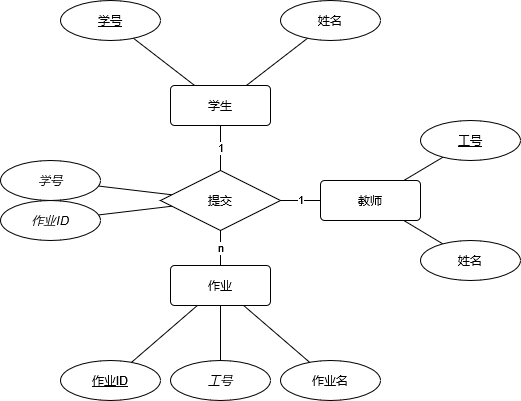

# 学委作业收集管理系统课程设计报告

## 需求分析

在教学过程中，组长、学委、老师需要收集同学们的作业。但是不同教师对作业的文件命名有自己的要求。同学们总会犯错误，在作业的文件命名上出一些小错误。如果由作业收集者人工校对每一个文件名，无疑是十分浪费时间的。这一过程过分重复且枯燥。而计算机恰好很擅长实现大批量的重复任务。因此，通过编程，为自动化检测作业提交情况，检测文件命名是否合规并重命名不规范的文件是很有必要的。

## 概念结构设计

首先明确，每个班级有不同的课程要上，而教师也需要上不同的课程。每节课还有多份不同的作业需要提交，因此需要设计一个三元关系来处理作业的提交情况。

## E-R图

4个局部ER图



## 数据库设计

### 逻辑结构设计
#### E-R模型向关系模式的转换
学生关系模式（<u>学生学号</u>, 学生姓名）

教师关系模式（<u>教师工号</u>, 教师姓名）

作业关系模式（<u>作业id</u>, *教师工号*, 作业标题）

提交关系模式（*学生学号*, *作业id*）
#### 实体关系设计

#### 数据库模式设计
students


### 物理设计
表格，结构


## 数据库实施


### 建立基本表
建表sql代码
**学生students表**
```sql
-- 创建学生表
CREATE TABLE students (
    student_id VARCHAR(50) PRIMARY KEY,
    student_name VARCHAR(50) NOT NULL
);
```

**教师teachers表**
```sql
-- 创建教师表
CREATE TABLE teachers (
    teacher_id VARCHAR(50) PRIMARY KEY,
    teacher_name VARCHAR(50) NOT NULL
);

```

**作业assignments表**

```sql
-- 创建作业布置表
CREATE TABLE assignments (
    assignment_id VARCHAR(50) PRIMARY KEY,
    teacher_id VARCHAR(50) NOT NULL,
    assignment_name VARCHAR(50) NOT NULL,
    FOREIGN KEY (teacher_id) REFERENCES teachers(teacher_id) ON UPDATE CASCADE ON DELETE NO ACTION
);
```

**提交submits表**
```sql

-- 创建作业统计表
CREATE TABLE submits (
    student_id VARCHAR(50) NOT NULL,
    assignment_id VARCHAR(50) NOT NULL,
    FOREIGN KEY (assignment_id) REFERENCES assignment(assignment_id) ON UPDATE CASCADE ON DELETE NO ACTION,
    FOREIGN KEY (student_id) REFERENCES students(student_id) ON UPDATE CASCADE ON DELETE NO ACTION
);

```


### 插入数据
insert into或者使用csv表格导入

### 建立游标

Python中使用sqlite3库函数，通过sqlite3.connect().cursor()方法建立游标。游标可以执行SQLite的SQL语句。


### 建立索引

m表建立aid和sid的索引
a表工号第一，aid第二。
### 创建视图
学生姓名和教师姓名
姓名和作业名

### 建立存储过程
可能用不上
### 触发器
插入之前查询数据是否已经存在
### 多种查询
简单查询
所有学生
复合查询
学生已提交的作业
未交作业的学生
跨表查询
学号和教师工号
姓名和作业标题
## 运行维护计划
定时复制
导出sql脚本
## 总结
尚未完成前端界面的编写
仍有不足